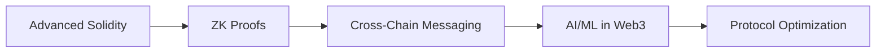

# 👋 Hi, I'm @mmarfinetz

  

## 📊 GitHub Stats

  

  

## 🏆 GitHub Trophies

  

## 📈 Contribution Graph

  
  <!-- Option 1: Enhanced Activity Graph with Custom Theme -->
  
  
  <!-- Option 2: 3D Contribution Calendar -->
  <picture>
    <source media="(prefers-color-scheme: dark)" srcset="https://raw.githubusercontent.com/mmarfinetz/mmarfinetz/output/github-contribution-grid-snake-dark.svg">
    <source media="(prefers-color-scheme: light)" srcset="https://raw.githubusercontent.com/mmarfinetz/mmarfinetz/output/github-contribution-grid-snake.svg">
    
  </picture>
  

<!-- Alternative: Isometric Contribution Calendar -->

  

## 💻 Tech Stack

  
  
  
  
  
  
  
  
  
  
  

## 🚀 About Me

  
  
  

I'm a developer passionate about the convergence of **cryptocurrency** and **artificial intelligence**, specializing in DeFi applications. I build innovative solutions that leverage AI to enhance decentralized finance protocols.

### 👀 What I'm Working On

- 🤖 **AI-Powered DeFi Solutions** - Integrating machine learning models with smart contracts
- 💎 **MEV Research** - Developing strategies for maximal extractable value
- 🔗 **Cross-Chain Protocols** - Building bridges between different blockchain ecosystems
- 📊 **Automated Trading Systems** - Creating intelligent trading bots for DeFi markets

### 🌱 Currently Learning

### 🤝 Open to Collaborate On

- 🏗️ DeFi Protocol Development
- 🧠 AI-Enhanced Trading Systems
- 🌉 Cross-chain Infrastructure
- 🔐 Smart Contract Security Audits

### 📫 Connect With Me

  
  
  
  
  

---

  
  
   
  
  <i>Building the future of finance</i>

